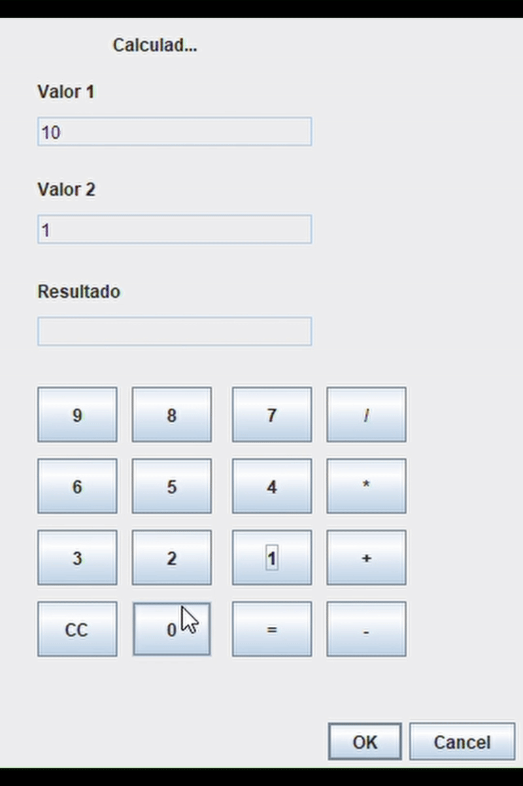

# Calculadora em Java com Interface Gráfica (Swing)

Este projeto é uma calculadora simples com interface gráfica construída utilizando **Java Swing**. A calculadora permite ao usuário inserir dois valores e realizar operações básicas como **adição, subtração, multiplicação e divisão**, exibindo o resultado ao final.

## Funcionalidades

- Interface gráfica amigável
- Teclado numérico na interface
- Campos de entrada bloqueados para digitação direta (valores são inseridos pelos botões)
- Operações disponíveis:
  - Soma (+)
  - Subtração (-)
  - Multiplicação (*)
  - Divisão (/)
- Botão "=" para exibir o resultado
- Botão "CC" para limpar todos os campos

## Demonstração

### 📷 Imagens da Interface

<p align="center">
  
</p>

## Tecnologias Utilizadas

- Java
- Java Swing (JDialog, JPanel, JTextField, JButton, JLabel)

## Estrutura do Projeto

A classe principal é `CalculadoraPanel.java`, que herda de `JDialog` e contém toda a lógica e layout da calculadora.

### Organização dos Componentes:

- **JTextField textField:** Valor 1
- **JTextField textField_1:** Valor 2
- **JTextField textField_2:** Resultado

### Comportamento:

- O usuário seleciona o campo que deseja preencher clicando nele (Valor 1 ou Valor 2)
- Os botões de número (0–9) inserem valores no campo selecionado
- Botões de operação realizam o cálculo e armazenam o resultado em `valorAtual`
- O botão `=` exibe o resultado final no campo "Resultado"
- O botão `CC` limpa todos os campos

## Como Executar

1. Clone o repositório:
   ```bash
   git clone https://github.com/seu-usuario/nome-do-repositorio.git
